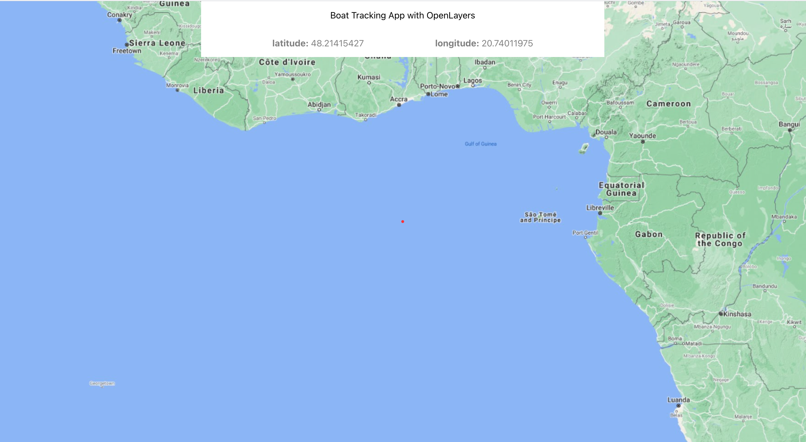

## Boat Tracking App

### About

[](https://github.com/prettier/prettier)

Track your boat's movement on any device with a web browser. Create records of position data with a press of a button.

The application uses WebSocket connections to efficiently deal with real-time events across multiple clients.

#### MockApp

A simple mock application written in **Python** that streams boat position data to connected clients over a socket.io implementation in _JSON format_.

The program runs an `asyncio` event loop until its task is finished. The provided _csv files_ are processed into JSON "messages" and sent to the server at 1 Hz rate. API:

```json
{
  "lat": "48.21339894",
  "lon": "20.73998593",
  "heading": "3.470315226"
}
```

#### ServerApp

An **Express.js** server that:

1. listens to the stream of boat positions, and emits messages towards the React client using `socket.io`
2. persists data in a **PostgreSQL** database with stored procedures for efficiency

#### ClientApp

A **React.js** project bootstrapped with [Create React App](https://github.com/facebook/create-react-app).

Built on a single page based on the **OpenLayers** API, it listens to the server using `socket.io-client`, and tries to represent movement on the map.

As of this time, the ClientApp cannot fulfill its purpose as it does not display coordinate / vector changes dynamically.

### Installation

- Set up python environment using `virtualenv` or similar: `pip3 install -r requirements.txt`
- Use Node version 15.8.0 (consider using a version manager like `nvm`)
- Install Node.js project dependencies: `npm install`
- Set up a PostgreSQL database, and run the .sql script
- Install React.js project dependencies: `npm install`

### Tech used / Dependencies

- Add-on packages include:
  - [Express](https://www.npmjs.com/package/express)
  - [socket.io](https://www.npmjs.com/package/socket.io)
  - [OpenLayers](https://www.npmjs.com/package/ol)
  - [TypeScript](https://www.npmjs.com/package/typescript)
  - [asyncio](https://pypi.org/project/asyncio/)

---


